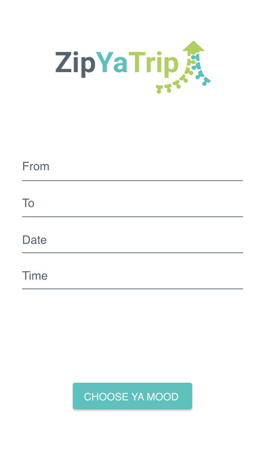
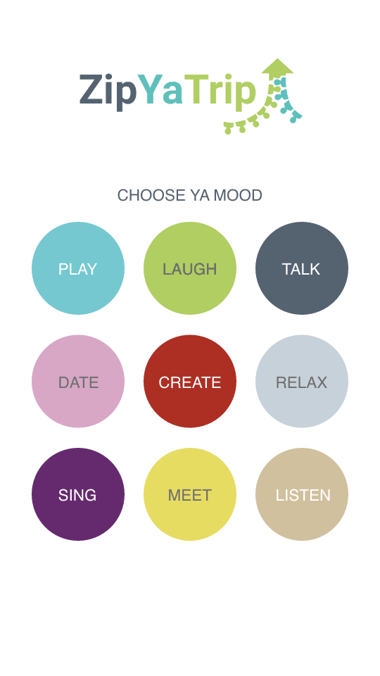
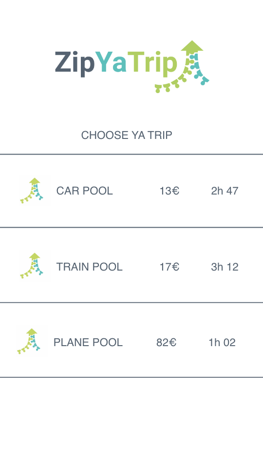
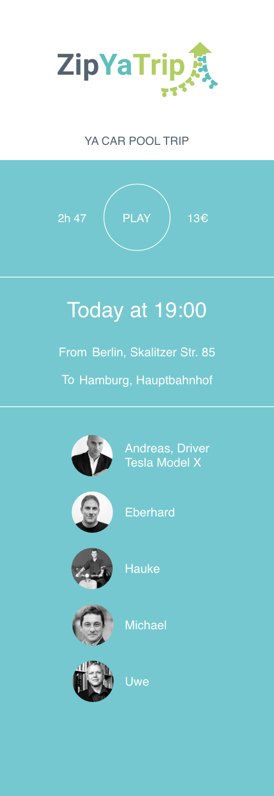
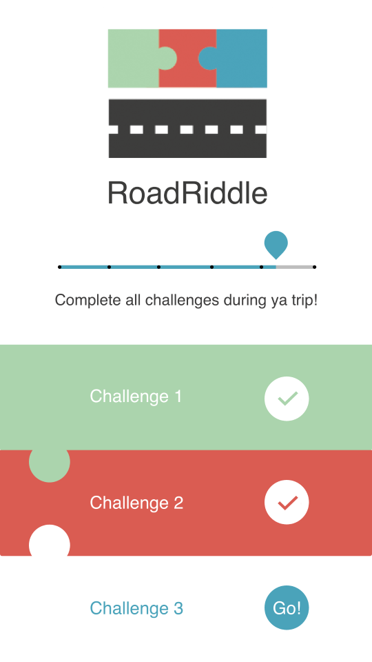
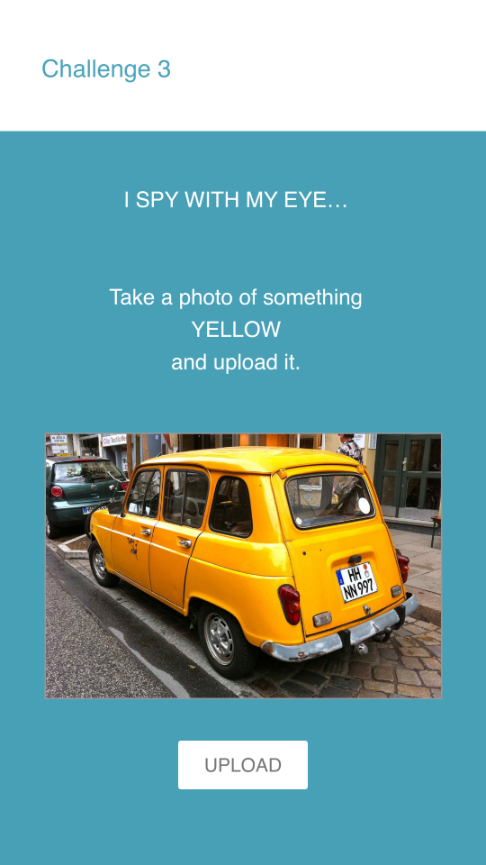
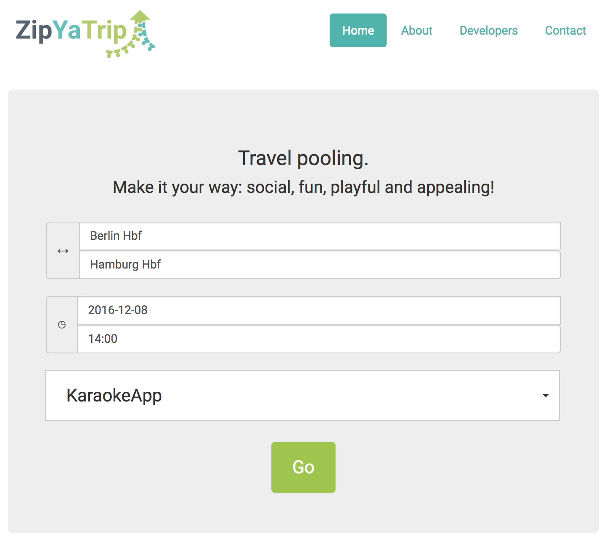
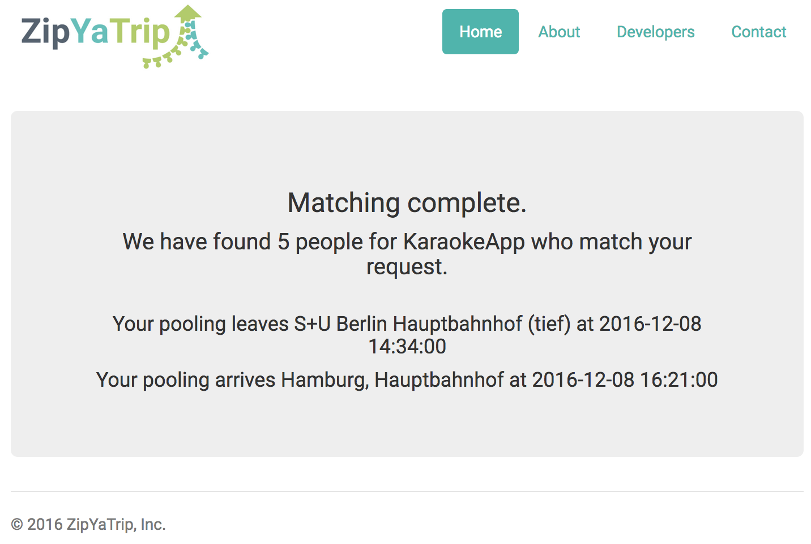

# ZipYaTrip

Average occupancy of passenger vehicles in Europe is 1.5 persons. This means too many cars in the street causing traffic jams and high CO2 emissions. However, traveling in public transportation or car pooling can be very boring. We decided to tackle both problems at the same time.

Our platform (ZipYaTrip) connects people who are traveling the same route, it also breaks the barrier between them, so they can interact, get to know each other, and be productive together. ZipYaTrip connects people for travel pooling and provides activities while traveling.

